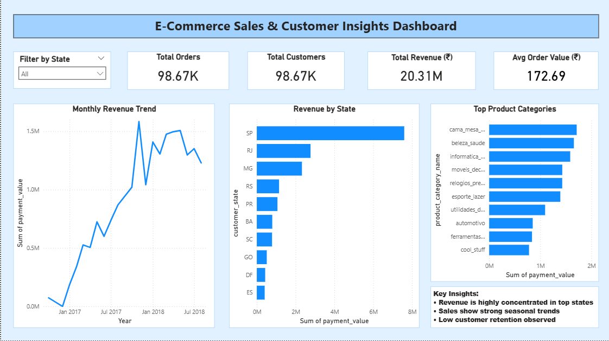

# 🛒 E-Commerce Sales & Customer Insights Dashboard

An interactive Power BI dashboard analyzing e-commerce sales data to uncover key business insights around revenue trends, customer behavior, and product performance — built on top of a Python + SQL ETL pipeline.

## 📊 Project Overview
This project processes raw e-commerce transaction data end-to-end — from cleaning and loading into a database, through to a fully interactive Power BI dashboard — to help stakeholders understand where revenue is coming from, how it trends over time, and which product categories and regions matter most.

## 📈 Dashboard Highlights
- **98.67K** total orders and customers tracked
- **₹20.31M** total revenue analyzed
- **₹172.69** average order value
- **Monthly Revenue Trend** — tracks revenue from Jan 2017 through mid-2018, highlighting seasonal peaks and dips
- **Revenue by State** — geographic breakdown showing revenue heavily concentrated in top-performing states (SP, RJ, MG)
- **Top Product Categories** — ranks categories by revenue (home & furniture, beauty & health, electronics leading the pack)
- Interactive **state filter** for drilling into region-specific performance

## 🔧 Tools Used
- **Python** — ETL and data processing (cleaning, merging, transforming raw transaction data)
- **SQL** — querying and aggregating data for business insights
- **Power BI** — building the interactive dashboard and visualizations

## 📌 Key Insights
- Revenue is highly concentrated in a handful of top states, with the rest showing a long tail
- Sales show strong seasonal trends, with clear spikes around late 2017/2018
- Most customers are one-time buyers — low retention is a key opportunity area for the business to address
- A small number of product categories (home/furniture, beauty, electronics) drive a disproportionate share of revenue

## 🚀 What I Learned
- Cleaning and merging large, messy transactional datasets
- Writing SQL queries to answer specific business questions
- Building interactive, filterable dashboards in Power BI
- Translating raw data into insights a non-technical stakeholder can act on

## 📁 Files
- `dashboard.png` — dashboard screenshot

## 📍 Status
Completed as part of my personal Data Analytics portfolio.

## 🔗 Contact
📧 fernandesclancy17@gmail.com
💼 [linkedin.com/in/clancyfernandes](https://linkedin.com/in/clancyfernandes)
